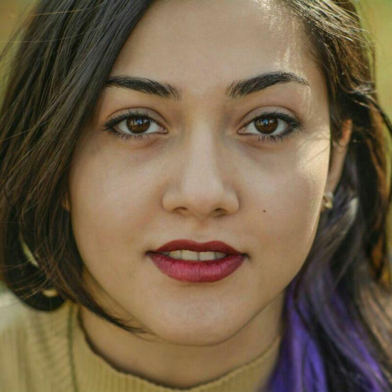
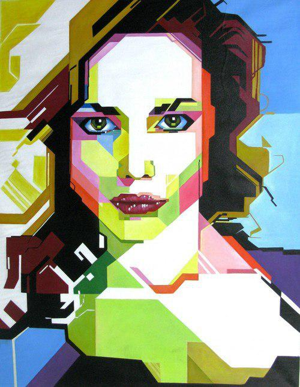
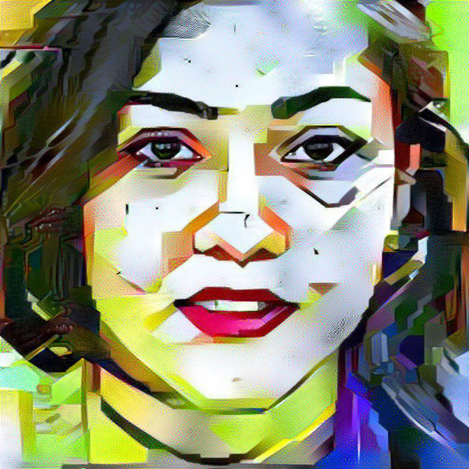

# style_transfer
neural style transfer using VGG19 pertained network and laplacian pyramid normalization

results were obtained on Nvidia_Geforce-1080Ti with 1000 iterations and less in some cases.
L-BFGS-B optimizaer in scipy was used.

>To use the VGG networks, the npy files for [VGG19 NPY](https://mega.nz/#!xZ8glS6J!MAnE91ND_WyfZ_8mvkuSa2YcA7q-1ehfSm-Q1fxOvvs) has to be downloaded, and placed in the directory of the code.

The github repository https://github.com/machrisaa/tensorflow-vgg was used for the pretrained network of VGG19 with modification such as making the image size flexible.

>the input images can be of any shape but must be "rgb" format.

some Results:

>input images:

  
  

>output image:

  

